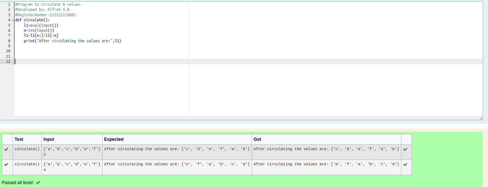

# Circulate-the-values-of-N-variables
## Aim:
To write a python program to circulate the n variables using function concept
## Equipment’s required:
PC
Anaconda - Python 3.7
## Algorithm: 
### Step 1: 
get the list of values from the user
### Step 2: 
get the inpyt from the user
### Step 3: 
Get the value from the user for the number of rotation
### Step 4: 
Using the slicing concept rotate the list

### Step 5: 
Execute the code
### Step 6: 
end the program
## Program:
```
#Program to circulate N values.
#Developed by: Alfred A.B.
#RegisterNumber:212222110002
def circulate():
    l1=eval(input())
    n=int(input())
    l1=l1[n:]+l1[:n]
    print("After circulating the values are:",l1)
```

## Output:


## Result:
 The program is executed successfully
